# E-Learning Platform

A full-stack web application for online education that allows students to enroll in courses, study structured theory content, and practice with both timed and untimed quizzes. The platform includes a teacher's cabinet where instructors can create, edit, and manage their courses. Built with Django REST Framework on the backend and React with Vite on the frontend.

### For Students

## Overview

This application provides a complete learning management system where students can browse available courses, enroll in them, study theoretical materials, and test their knowledge through practice quizzes. Teachers have dedicated tools to create and manage courses, modules, and topics. The platform supports both timed and untimed test modes, tracks student progress, and maintains a history of all attempts.

The system features a responsive design that works on desktop and mobile devices, includes dark theme support, and allows users to customize their profiles with background gradients and avatars.

## Core Features

### For Students

- Public course catalog with search and filtering capabilities
- Course enrollment system with JWT authentication (cookies-based)
- Structured learning path: theory content followed by practice quizzes
- Two types of practice tests: timed and untimed
- Progress tracking showing completion status and scores for each topic
- Test history with detailed view of all previous attempts
- Single-choice and multiple-choice question types
- Visual feedback for correct and incorrect answers
- Profile customization with avatar upload and background gradient selection
- Dark theme support with customizable settings
- Cookie consent banner for data privacy compliance
- Course cover images displayed in course listings
- Navigation lock notification during timed tests

### For Teachers

- Dedicated teacher's cabinet accessible via role-based permissions
- Create, edit, and delete courses with inline module and topic management
- Upload course cover images displayed in course cards
- Manage modules and topics directly within the course edit page
- Add modules and topics inline without navigating to separate pages
- Set up theory content for each topic (optional)
- Configure practice questions with single or multiple correct answers
- Enable timed tests with configurable time limits (30 seconds to 30 minutes)
- Time limit configuration with separate minutes (0-29) and seconds (0-59) inputs
- View all courses created by the teacher with course images in cards
- Course card dropdown menu with Edit and Delete options
- Confirmation modal for course deletion
- Automatic slug generation for courses
- Full CRUD operations via REST API with nested data support

## Technology Stack

### Backend

- Django 5.2.8 - Web framework
- Django REST Framework - API development with nested serializers
- Django REST Framework Simple JWT - Authentication
- django-allauth - OAuth authentication (Google, GitHub)
- django-cors-headers - CORS handling
- django-filter - API filtering
- PostgreSQL - Database
- Pillow - Image processing for avatars and course images
- psycopg2-binary - PostgreSQL adapter

### Frontend

- React 19 - UI library with hooks
- Vite - Build tool and development server
- React Router - Client-side routing
- Axios - HTTP client for API calls with FormData support
- CSS3 - Styling with custom themes and responsive design
- Context API - Theme and language management

### Development Tools

- ESLint - Code linting
- Django Admin - Content management interface
- Hot Module Replacement - Fast development experience

## Installation and Setup

### Prerequisites

- Python 3.11 or higher
- Node.js 20 or higher
- PostgreSQL database server (running locally or accessible remotely)
- npm or yarn package manager

### Backend Setup

1. Navigate to the backend directory:
   ```bash
   cd backend
   ```

2. Create a virtual environment:
   ```bash
   python -m venv .venv
   ```

3. Activate the virtual environment:
   - On Windows:
     ```bash
     .\.venv\Scripts\activate
     ```
   - On Linux/Mac:
     ```bash
     source .venv/bin/activate
     ```

4. Install required packages:
   ```bash
   pip install -r requirements.txt
   ```

5. Configure environment variables:
   - Create `backend/.env` file
   - Add: `DJANGO_SECRET_KEY`, `DB_NAME`, `DB_USER`, `DB_PASSWORD`, `DB_HOST`, `DB_PORT`, `GOOGLE_CLIENT_ID`, `GOOGLE_CLIENT_SECRET`
   - Generate SECRET_KEY: `python -c "from django.core.management.utils import get_random_secret_key; print(get_random_secret_key())"`

6. Configure PostgreSQL database:
   
   Open PostgreSQL command line as a superuser (e.g., `psql -U postgres`) and run:
   ```sql
   CREATE DATABASE elearning;
   CREATE USER elearn_user WITH PASSWORD 'your_password_here';
   GRANT ALL PRIVILEGES ON DATABASE elearning TO elearn_user;
   ALTER ROLE elearn_user SET client_encoding TO 'UTF8';
   ALTER ROLE elearn_user SET timezone TO 'Europe/Bratislava';
   \q
   ```

7. Run database migrations:
   ```bash
   python manage.py makemigrations
   python manage.py migrate
   ```

8. Create a superuser account:
   ```bash
   python manage.py createsuperuser
   ```
   Follow the prompts to create an admin account.

9. Start the development server:
   ```bash
   python manage.py runserver
   ```
   The API will be available at http://127.0.0.1:8000/

### Frontend Setup

1. Navigate to the frontend directory:
   ```bash
   cd frontend
   ```

2. Install dependencies:
   ```bash
   npm install
   ```

3. Configure environment variables:
   - Create `frontend/.env` file
   - Add: `VITE_GOOGLE_CLIENT_ID=your-google-client-id`

4. Start the development server:
   ```bash
   npm run dev
   ```
   The application will be available at http://localhost:5173/

## Using the Application

### Creating Courses

There are two ways to create courses:

#### Via Django Admin

1. Navigate to http://127.0.0.1:8000/admin/
2. Log in with your superuser credentials
3. In the admin interface, you can:
   - Create new Users (set their role to "teacher" if they should be able to create courses)
   - Create Courses with title and description
   - Add Modules to courses
   - Add Topics to modules with theory content
   - Create Topic Questions with options and mark correct answers
   - Set time limits for timed tests on topics

#### Via Teacher's Cabinet

1. Log in as a user with teacher role
2. Navigate to "My Courses" (Moje kurzy) from the navigation menu
3. Click "Create New Course" to create a new course, or click on an existing course card to open a dropdown menu
4. In the dropdown menu, select "Edit" to edit the course or "Delete" to remove it (with confirmation)
5. On the course edit page:
   - Fill in the course title and description
   - Upload a course cover image (optional)
   - Click "Add Module" to add a new module inline
   - Enter module title directly in the input field
   - Click "Add Topic" within a module to add topics inline
   - Enter topic title and theory content
   - Enable timed test and configure time limit using minutes (0-29) and seconds (0-59) inputs
   - Add questions with options for each topic
6. Click "Save" to save all changes. New modules and topics will receive IDs after saving.

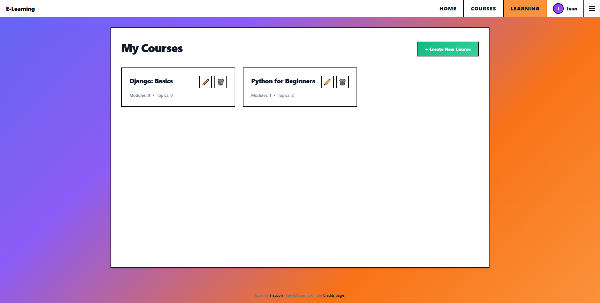

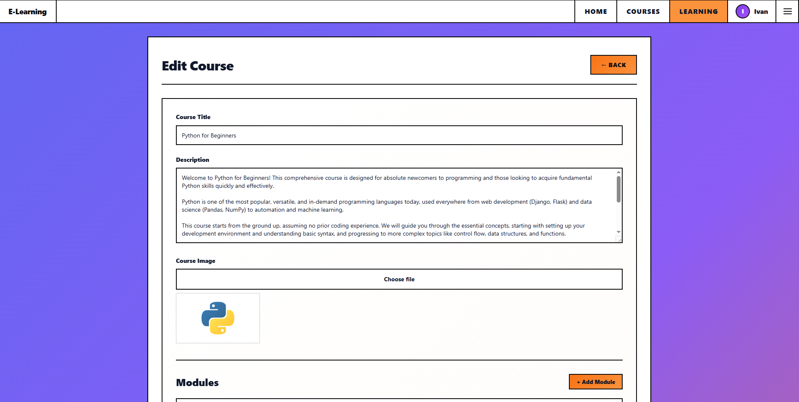

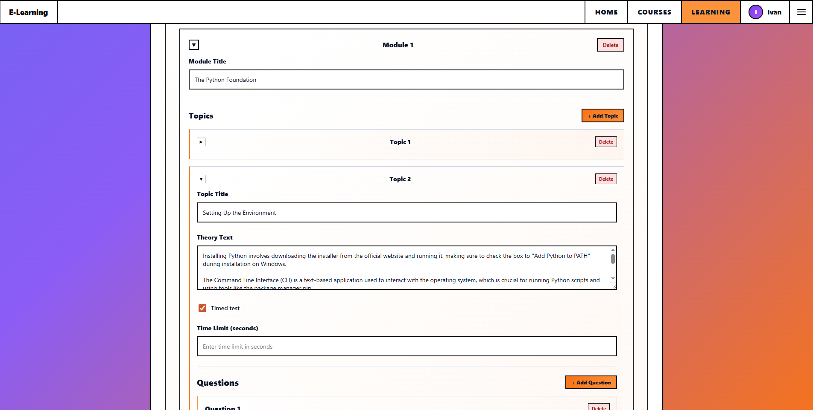

### Student Workflow

1. **Browse Courses**: Visit the Courses page to see all available courses with search and filter options.

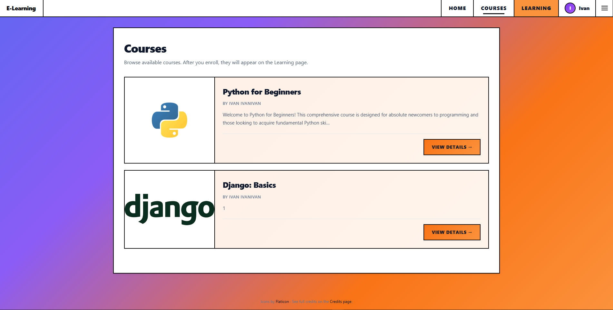

2. **View Course Details**: Click on any course to see its description, modules, topics, and enroll button. Course cover images are displayed prominently.

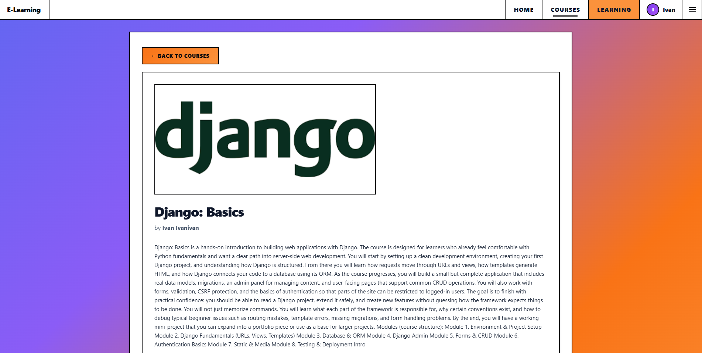

3. **Enroll in Course**: Click "Enroll" on a course detail page to add it to your learning dashboard.

4. **Take Practice Test**: Navigate to the Learning section, select a course, and click on any topic to start answering questions. You can choose between timed and untimed modes if the topic supports both.

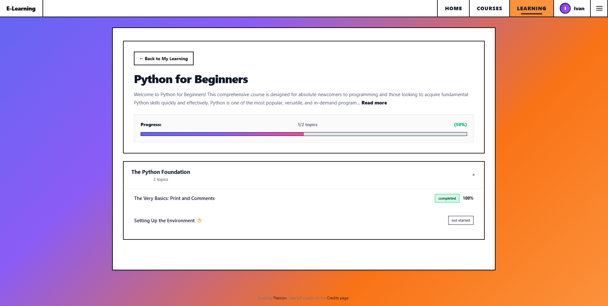

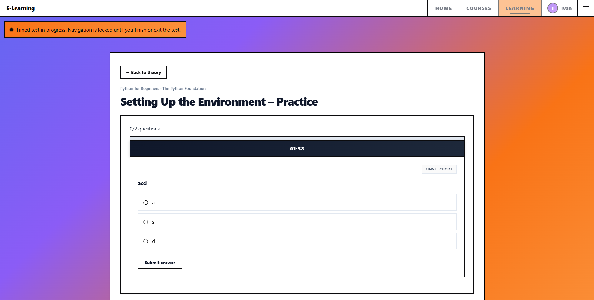

6. **View Results**: After completing a test, see your score, pass/fail status, and detailed answer breakdown.


7. **Review History**: Access your test history to review previous attempts and see which answers you selected.

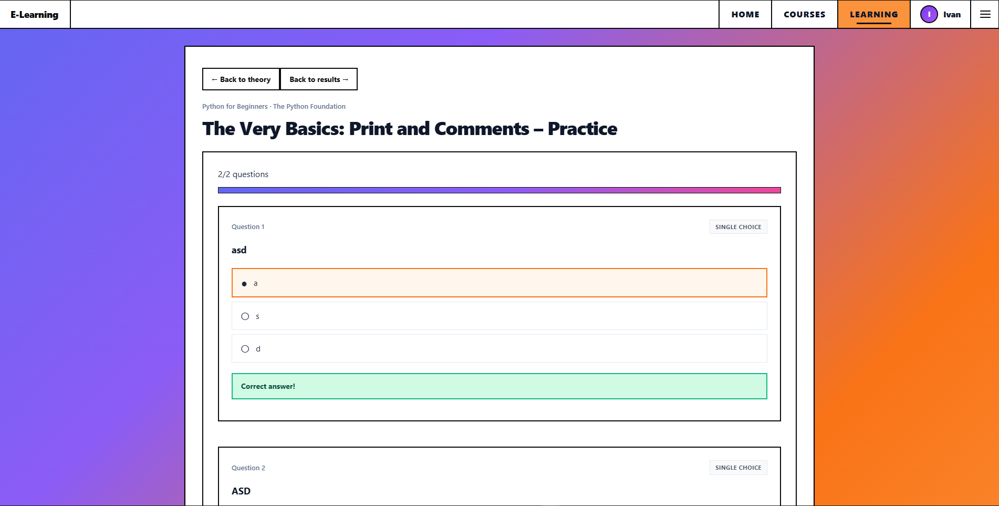

8. **Track Progress**: Monitor your learning progress with visual indicators showing which topics are completed, in progress, or failed.


### Additional Features

- **Profile Customization**: Upload an avatar and choose from various background gradients for your profile page
- **Dark Theme**: Switch between light and dark themes in Settings (with theme selector on landing, login, and register pages)
- **Language Selection**: Choose between English and Slovak (full internationalization support)
- **Mobile Responsive**: The application adapts to different screen sizes
- **Credits Page**: Dedicated page showing all technologies, libraries, and resources used

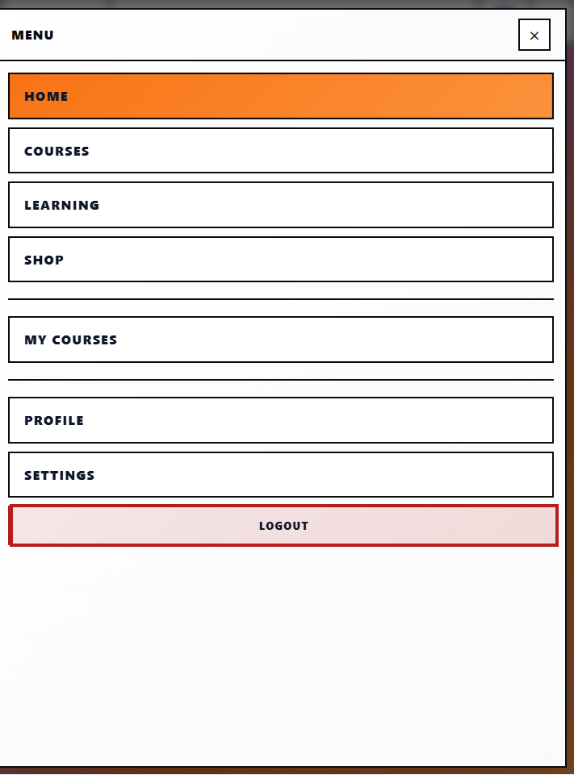

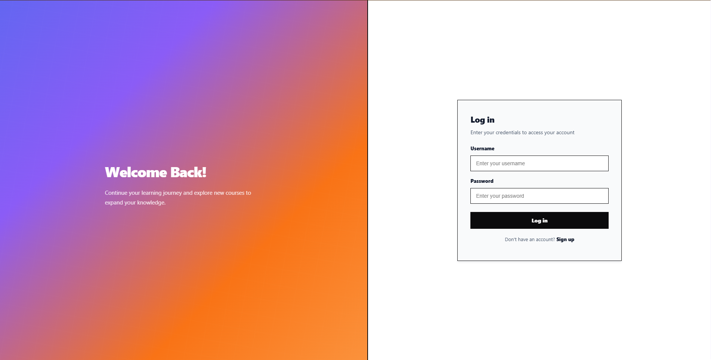

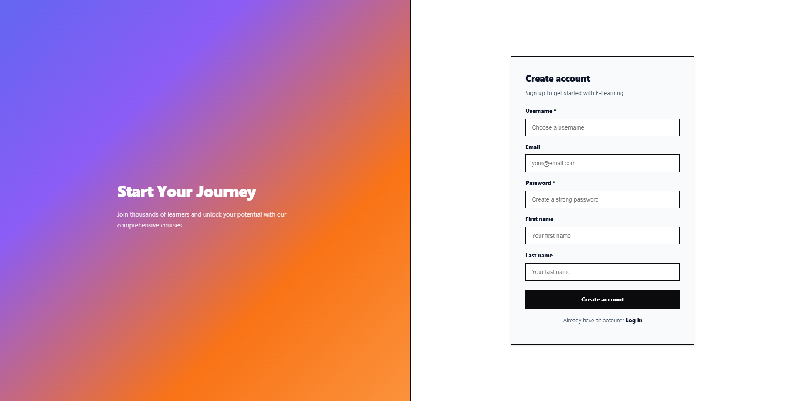

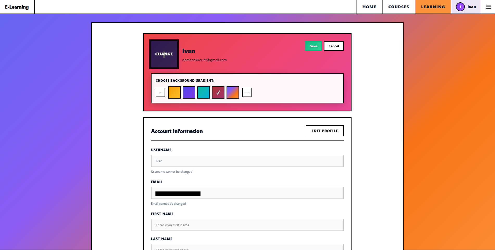


## REST API Documentation

All API endpoints are prefixed with `/api/`. Authenticated endpoints require a JWT access token in the `Authorization: Bearer <token>` header.

### Authentication Endpoints

- `POST /api/auth/register/` - Register a new user
  - Request body: `username`, `email`, `password`, `first_name`, `last_name` (optional)
  - Returns: User data with tokens

- `POST /api/auth/token/` - Obtain JWT access and refresh tokens
  - Request body: `username` (or `email`), `password`
  - Returns: `access` and `refresh` tokens

- `POST /api/auth/token/refresh/` - Refresh the access token
  - Request body: `refresh` token
  - Returns: New `access` token

- `POST /api/auth/google/` - Authenticate with Google OAuth
  - Request body: `token` (Google ID token)
  - Returns: `access`, `refresh` tokens and user data

- `GET /api/auth/me/` - Get current user profile (authenticated)
  - Returns: User profile data including avatar URL and profile background

- `PATCH /api/auth/me/` - Update current user profile (authenticated)
  - Request body: `first_name`, `last_name`, `email`, `username`, `avatar` (file), `profile_background_gradient` (string)
  - Returns: Updated user profile

### Course Endpoints

- `GET /api/courses/` - Get public course list
  - Query parameters: `search`, `ordering`, `author_id`
  - Returns: List of courses with basic information

- `GET /api/courses/<id>/` - Get course details
  - Returns: Course data including modules and topics

- `POST /api/courses/<id>/enroll/` - Enroll authenticated user in course
  - Returns: Enrollment confirmation

- `GET /api/my-courses/` - Get courses enrolled by current user (authenticated)
  - Returns: List of enrolled courses

### Teacher Endpoints

All teacher endpoints require authentication and the `IsTeacher` permission.

- `GET /api/teacher/courses/` - List all courses created by the current teacher
  - Returns: List of courses with nested modules and topics

- `POST /api/teacher/courses/` - Create a new course
  - Request body: `title`, `description`, `image` (file, optional), `modules` (JSON string in FormData with nested topics)
  - Content-Type: `multipart/form-data` (always used, even without image)
  - Returns: Created course data with `image_url`
  - Note: `author` is automatically set to the current user, `slug` is auto-generated. `modules` must be sent as a JSON string in FormData.

- `GET /api/teacher/courses/<id>/` - Get course details for editing
  - Returns: Course data with all nested modules and topics

- `PUT /api/teacher/courses/<id>/` - Update a course
  - Request body: `title`, `description`, `image` (file, optional), `modules` (JSON string in FormData with nested topics)
  - Content-Type: `multipart/form-data` (always used, even without image)
  - Returns: Updated course data with `image_url`
  - Note: `modules` must be sent as a JSON string in FormData. The backend automatically parses it.

- `PATCH /api/teacher/courses/<id>/` - Partially update a course
  - Request body: Any subset of course fields
  - Returns: Updated course data

- `DELETE /api/teacher/courses/<id>/` - Delete a course
  - Returns: 204 No Content

- `GET /api/teacher/modules/` - List modules for teacher's courses
- `POST /api/teacher/modules/` - Create a new module
  - Request body: `title`, `order`, `course`, `topics` (array with nested questions, optional)
  - Returns: Created module data
  - Note: Modules can be created without topics initially
- `GET /api/teacher/modules/<id>/` - Get module details
- `PUT /api/teacher/modules/<id>/` - Update a module
- `PATCH /api/teacher/modules/<id>/` - Partially update a module
- `DELETE /api/teacher/modules/<id>/` - Delete a module

- `GET /api/teacher/topics/` - List topics for teacher's courses
- `POST /api/teacher/topics/` - Create a new topic
  - Request body: `title`, `content` (optional), `order`, `module` (required), `is_timed_test`, `time_limit_seconds` (30-1800 seconds), `questions` (array, optional)
  - Returns: Created topic data
  - Note: `time_limit_seconds` must be between 30 and 1800 seconds (30 minutes) when `is_timed_test` is true. `module` is required when creating a new topic.
- `GET /api/teacher/topics/<id>/` - Get topic details
- `PUT /api/teacher/topics/<id>/` - Update a topic
  - Request body: `title`, `content` (optional), `order`, `is_timed_test`, `time_limit_seconds` (30-1800 seconds), `questions` (array)
  - Returns: Updated topic data
  - Note: `time_limit_seconds` must be between 30 and 1800 seconds when `is_timed_test` is true. `module` field should not be included when updating.
- `PATCH /api/teacher/topics/<id>/` - Partially update a topic
- `DELETE /api/teacher/topics/<id>/` - Delete a topic

### Learning and Practice Endpoints

All learning endpoints require authentication and enrollment in the related course.

- `GET /api/learning/courses/<id>/` - Get course content with progress tracking
  - Returns: Course data with per-topic progress, status, and scores

- `GET /api/learning/topics/<id>/` - Get topic theory and progress
  - Returns: Topic theory content and current progress status

- `GET /api/learning/topics/<id>/next-question/` - Get next practice question
  - Query parameters: For timed tests, includes `remaining_seconds` and timer status
  - Returns: Question data with options (correct answers not included for timed tests)

- `POST /api/learning/questions/<id>/answer/` - Submit answer(s) to a question
  - Request body: `selected_options` (array of option IDs)
  - Returns: Correctness status, updated score, progress, and next question or completion status

- `POST /api/learning/topics/<id>/reset/` - Reset practice progress for a topic
  - Returns: Confirmation of reset

- `GET /api/learning/topics/<id>/history/` - Get test history for completed/failed topics
  - Returns: Full question history with selected options and correctness

### Response Data Structure

Timed tests return additional fields:
- `remaining_seconds` - Time remaining for the current question
- `time_limit_seconds` - Total time limit for the topic
- `timed_out` - Boolean indicating if time has expired
- `passed` - Boolean indicating if the test was passed

Progress tracking includes:
- `progress_percent` - Percentage of questions answered
- `score_percent` - Percentage of correct answers
- `status` - One of: "not_started", "in_progress", "completed", "failed"
- Per-question correctness data for detailed feedback

## Project Structure

```
web_application_thesis/
├── backend/
│   ├── core/
│   │   ├── models/
│   │   │   ├── user.py          # User model with avatar and profile customization
│   │   │   ├── course.py        # Course, Module models
│   │   │   └── learning.py      # Topic, TopicQuestion models with timed test support
│   │   ├── serializers/
│   │   │   ├── user.py          # User serialization with avatar URLs
│   │   │   ├── course.py        # Course serialization
│   │   │   ├── learning.py      # Learning progress serialization
│   │   │   └── teacher.py       # Teacher CRUD serializers
│   │   ├── views/
│   │   │   ├── auth.py          # Registration and profile endpoints
│   │   │   ├── courses.py       # Public course endpoints
│   │   │   ├── learning.py      # Learning and practice endpoints
│   │   │   └── teacher.py       # Teacher CRUD endpoints
│   │   ├── permissions.py       # IsTeacher permission class
│   │   └── urls.py              # URL routing
│   ├── elearn_backend/
│   │   ├── settings.py          # Django settings including media configuration
│   │   └── urls.py              # Root URL configuration
│   ├── media/                   # Uploaded user avatars
│   ├── manage.py
│   └── requirements.txt
├── frontend/
│   ├── src/
│   │   ├── app/
│   │   │   └── App.jsx          # Main app component with routing
│   │   ├── pages/
│   │   │   ├── auth/            # Login and registration pages
│   │   │   ├── courses/         # Course catalog and detail pages
│   │   │   ├── learning/        # Learning dashboard and practice pages
│   │   │   ├── profile/         # User profile with customization
│   │   │   ├── settings/        # Theme and language settings
│   │   │   └── teacher/         # Teacher's cabinet pages
│   │   ├── features/
│   │   │   ├── courses/         # Course card component
│   │   │   └── learning/        # Practice question and timer components
│   │   ├── shared/
│   │   │   ├── api/             # API client configuration
│   │   │   ├── lib/             # Theme and language contexts
│   │   │   └── styles/          # Global styles and theme variables
│   │   └── widgets/
│   │       └── layout/          # Main layout with navigation
│   ├── public/
│   └── package.json
├── screenshots/                 # Application screenshots
└── README.md
```

## Configuration

### Environment Variables

**Backend (`backend/.env`):**
- `DJANGO_SECRET_KEY` - Django secret key (generate with: `python -c "from django.core.management.utils import get_random_secret_key; print(get_random_secret_key())"`)
- `DB_NAME`, `DB_USER`, `DB_PASSWORD`, `DB_HOST`, `DB_PORT` - PostgreSQL settings
- `GOOGLE_CLIENT_ID`, `GOOGLE_CLIENT_SECRET` - Google OAuth credentials

**Frontend (`frontend/.env`):**
- `VITE_GOOGLE_CLIENT_ID` - Google OAuth Client ID (same as backend)

**Important:** Never commit `.env` files to Git. They are already in `.gitignore`.

## Development Notes

- The application uses JWT tokens stored in cookies for authentication (with cookie consent banner)
- Cookie consent is required on first visit - users must accept cookies to continue
- Google OAuth authentication via `django-allauth` - accounts are automatically linked by email
- GitHub OAuth authentication is also supported
- Image uploads are handled via FormData and stored in `backend/media/users/` (for avatars) and `backend/media/courses/` (for course images)
- Profile background gradients are stored as CSS gradient strings
- Course slugs are automatically generated from titles and made unique
- Course images are displayed in course cards and detail pages
- Teacher permissions are enforced via the `IsTeacher` permission class
- All teacher operations are filtered to only show/modify courses created by the current user
- Course editing interface supports inline module and topic creation/editing
- Modules and topics can be added and edited directly on the course edit page
- Time limit configuration: 30 seconds minimum, 30 minutes (1800 seconds) maximum
- Time limit input uses separate fields for minutes (0-29) and seconds (0-59)
- Navigation is locked during timed tests with a visual notification banner
- Full internationalization (i18n) support for English and Slovak languages
- All user-facing text is translatable via LanguageContext
- Course cards in teacher's cabinet show course images with dropdown menus for Edit/Delete actions

## Next Steps After Setup

1. Create `.env` files for backend and frontend (see Configuration section)
2. Configure Google OAuth in Google Cloud Console
3. Run migrations: `python manage.py migrate`
4. Start backend: `python manage.py runserver`
5. Start frontend: `npm run dev`
6. Test authentication: Register, Login, Google OAuth

See `explaining_account_linking.md` for detailed explanation of how account linking works (in Russian).

## Recent Updates

### Teacher's Cabinet Improvements

- **Inline Module and Topic Management**: Modules and topics can now be added and edited directly on the course edit page without navigating to separate pages
- **Course Card UI**: Course images are displayed in cards with dropdown menus for Edit/Delete actions
- **Time Limit Configuration**: Improved time limit input with separate fields for minutes (0-29) and seconds (0-59), with validation for 30 seconds to 30 minutes range
- **CRUD Operations**: Fixed issues with saving modules and topics, ensuring proper data serialization and backend processing
- **Data Persistence**: Modules and topics now correctly receive IDs after saving and are properly displayed after page reload

### Internationalization

- **Full i18n Support**: Complete translation coverage for English and Slovak languages
- **Status Labels**: All learning status labels (Not started, In progress, Completed, Failed, Passed) are now properly translated
- **OAuth Buttons**: Google and GitHub authentication buttons display translated text based on selected language
- **Credits Page**: Fully translated credits page with footer links

### UI/UX Improvements

- **Theme Selectors**: Unified theme switching buttons across landing, login, and register pages
- **Course Cards**: Enhanced course cards in teacher's cabinet with images and dropdown menus
- **Form Validation**: Improved validation and error handling for course, module, and topic creation

## Future Development Plans

The platform is under active development. Planned features include:

1. User discussions and comments under theoretical content
2. Integration of an online Python code interpreter
3. Support for coding practice questions in addition to multiple-choice
4. In-app shop system for purchasing courses or additional features
5. Enhanced profile features and customization options
6. Additional animations and interactive components
7. Enhanced course content with rich media integration

## License

This project is developed for educational purposes as part of a bachelor's thesis.

## Credits

See the Credits page in the application or `frontend/src/pages/credits/ui/CreditsPage.jsx` for a complete list of technologies, libraries, and resources used in this project.
